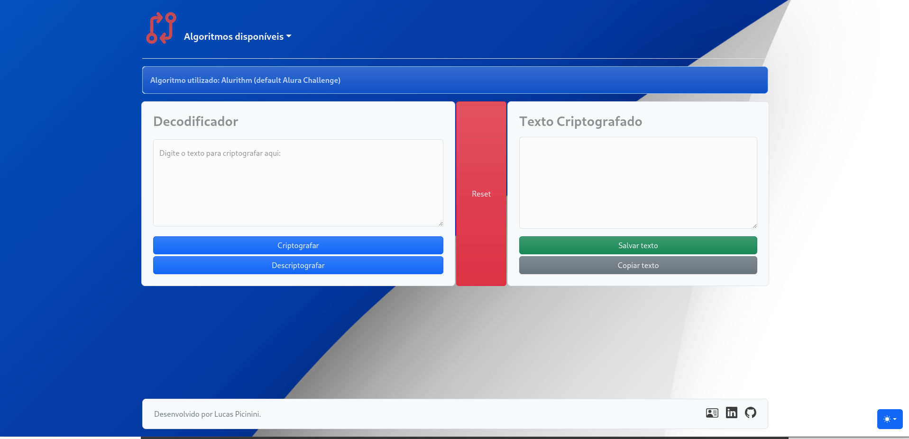

  
  <h3 align="center">Decodificador</h3>

  

    Criptografia e Descriptografia de Strings  
   Um desafio <strong>Alura</strong> x <strong>Oracle Next Education</strong>
     
    

 

# WebSite

[Clique aqui para acessar o Decodificador](https://lucaspicinini.github.io/decodificador/)

## Sobre o Desafio

**Requisitos:**

**As "chaves" de criptografia que utilizaremos são:**

- `A letra "e" é convertida para "enter"`
- `A letra "i" é convertida para "imes"`
- `A letra "a" é convertida para "ai"`
- `A letra "o" é convertida para "ober"`
- `A letra "u" é convertida para "ufat"`

- Deve funcionar apenas com letras minúsculas
- Não devem ser utilizados letras com acentos nem caracteres especiais
- Deve ser possível converter uma palavra para a versão criptografada e também retornar uma palavra criptografada para a versão original.

**Por exemplo:**

- `"gato" => "gaitober"`
- `gaitober" => "gato"`

A página deve ter campos para inserção do texto a ser criptografado ou descriptografado, e a pessoa usuária deve poder escolher entre as duas opções
O resultado deve ser exibido na tela.

**Extras:**

- Um botão que copie o texto criptografado/descriptografado para a área de transferência - ou seja, que tenha a mesma funcionalidade do ctrl+C ou da opção "copiar" do menu dos aplicativos.

## Funcionalidades que adicionei no projeto

- `Possibilidade do usuário criar seu próprio algoritmo de criptografia.`
- `Codificação de texto para QRCode.`
- `Funções salvar e excluir as strings em cards na interface.`
- `Alertas dinâmicos ao copiar e salvar textos.`
- `Modal de confirmação no momento do Reset.`
- `Modo dark, light e auto.`

### Tecnologia utilizada

    - HTML
    - CSS
    - Bootstrap 5
    - JavaScript

### Guia de Contribuição

Obrigado pela ajuda em tornar o **Decodificador** melhor.

- Faça um fork do repositório para sua conta.
- Crie uma nova branch para as mudanças (fica mais fácil de controlar as alterações).
- Realize as alterações nessa nova branch.
- Faça um Pull Request dessa branch para a branch main do repositório principal.

Se você está em dúvida sobre outra coisa ou sobre um Pull Request, abra uma [issue](https://github.com/lucaspicinini/decodificador/issues) para discussão.

#### License
  
* see [LICENSE](https://github.com/lucaspicinini/decodificador/blob/main/LICENSE) file

#### Versions
* Version 1.0 ~ 01/02/2023
